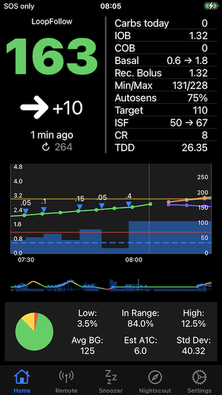

> **Message from the Loop and Learn Team:**
> * We have taken responsibility for updates to the LoopFollow app - many thanks to Jon Fawcett, the originator of this app
> * Additional LoopFollow documentation is at [Loop and Learn: LoopFollow](https://www.loopandlearn.org/loop-follow/)
> * If you are having problems with the app:
>     * Please join the [LoopFollow Facebook group](https://www.facebook.com/groups/loopfollowlnl);
>     * You can also post in the [Loop and Learn Facebook group](https://www.facebook.com/groups/LOOPandLEARN); but be sure to indicate that your question is related to LoopFollow
>     * If you do not use Facebook - please click on this [link to file an Issue](https://github.com/loopandlearn/LoopFollow/issues) with your problem

> **New location for LoopFollow Repository:**
> * If you previously created a fork of LoopFollow from the JonFawcett username
>    * Please note the repository name has changed to [https://github.com/loopandlearn/LoopFollow](https://github.com/loopandlearn/LoopFollow)
>    * GitHub should automatically redirect you to this new address
>    * We have also modifed one branch and one file name to match standard conventions: _main_ (from _Main_) and _README.md_ (from _readme.md_)

> **Message to Developers**

* Please click on this link: [For Developers](#for-developers)

## LoopFollow 

### Purpose:

Using so many different apps as a parent or caregiver of a T1D can be very cumbersome. Add in the extra details from looping with an Open Source Automated Insulin Delivery app 
and it can be a challenge flipping back and forth between apps. Each app has different strengths and weaknesses. LoopFollow melds together some needs into one app.

An example of the main screen for LoopFollow is shown in the graphic below:

}

### Building Options

Please see [Loop and Learn: LoopFollow](https://www.loopandlearn.org/loop-follow/) for all the building options.

With the release of version 2.1.0, there is now an easy option for building up to three instances of the LoopFollow app for multiple Loopers in your family. Each instance can be configured to have the display name you choose with these names being the default:

* LoopFollow
* LoopFollow_Second
* LoopFollow_Third

#### Display Name Updates

The _display_name_ is found in a single file.

* Suggestion if you customize the name: use LF {unique name} so you can find the apps easily in iOS Settings screen

Summary instructions by build method:

* Browser Build: 
    * Fork and setup the repository for each LoopFollow instance you want to use: 
        * https://github.com/loopandlearn/LoopFollow
        * https://github.com/loopandlearn/LoopFollow_Second
        * https://github.com/loopandlearn/LoopFollow_Third
    * Commit the desired _display_name_ in the LoopFollowDisplayNameConfig.xcconfig file of your forked repository for LoopFollow, LoopFollow_Second or LoopFollow_Third
* Mac-Xcode Build
    * First build with script, you will be prompted to enter the desired _display_name_
    * This _display_name_ is used each time you select a fresh download for LoopFollow 1, 2 or 3
    * To modify the _display_name_ for subsequent script builds, edit the appropriate file in the ~/Downloads/BuildLoopFollow folder
        *  LoopFollowDisplayNameConfig.xcconfig 
        *  LoopFollowDisplayNameConfig_Second.xcconfig 
        *  LoopFollowDisplayNameConfig_Third.xcconfig 

### Updates

When modifications and versions are updated, you might see activity at GitHub. Please wait for the release message to be posted at [LoopFollow Releases](https://github.com/loopandlearn/LoopFollow/releases) before using the updated versions for the `main` branch of LoopFollow, LoopFollow_Second and LoopFollow_Third.

### Version Numbers

Updates to the `main` branch (releases) have a version number that ends in 0; for example, 2.7.0.

* Immediately following the release, the `dev` branch is at the same version as `main` indicating the code is identical
* Each time a feature is merged into the `dev` branch, the final number increments; for example, 2.7.1, 2.7.2
* When the next release is made, the second digit is incremented and the final digit is restore to 0 for both `main` and `dev`; for example, 2.8.0

### General feature list

Please review the list on [Loop and Learn: LoopFollow](https://www.loopandlearn.org/loop-follow/).

Each time a release is made, the features added or bugs fixed for that particular release are found at [LoopFollow Releases](https://github.com/loopandlearn/LoopFollow/releases).

### Open Source DIY

> This is a DIY open source project that may or may not function as you expect. You take full responsibility for building and running this app and do so at your own risk.

## For Developers

> * If you are interested in assisting with this app and want to work on new features and improvements for Loop, Trio, iAPS and Nightscout functionality, please reach out. 
> * Issues and Pull Requests in GitHub are monitored and will get a response. 

New PR are directed to the dev branch. If you direct one to main, we will move it to point to dev. So always start with your code aligned with dev.

Always rename your branch (that is aligned with `dev`) to a name suitable for your feature, for example, `feature_name`, before starting to add commits to your branch.

After a PR is merged to `dev`, there is an automatic bump up the version number - please do not modify the version in your branch.

### Version Updates

Only the maintainers for LoopFollow will update version numbers.

### Release Process

To assist in releasing to all three LoopFollow repositories, the script `release.sh` is now available. This bumps up the version number to M.N+1.0 for a minor release or M+1.0.0 for a major release. It also updates the LoopFollow_Second and LoopFollow_Third repositories with parallel changes to what was just released for LoopFollow. Only LoopFollow uses a `dev` branch. The other repositories use just the `main` branch and are kept at the released version.

When a release is generated, the updates found in the `dev` branch are merged into `main`; the version number in the `Config.xcconfig` file is updated to A.B.O; a tag of the form v.A.B.0 is created and associated with the `main` branch at that time.

When PR are subsequently merged to `dev`, the version number is incremented by 1 in the last place, e.g., "v.A.B.1" etc.

### Files in LoopFollow Only

There are several files found only in the LoopFollow repository:

* .github/workflow/auto_version_dev.yml
* release.sh

These files are not added to _Second or _Third version because they are not needed for those repositories.